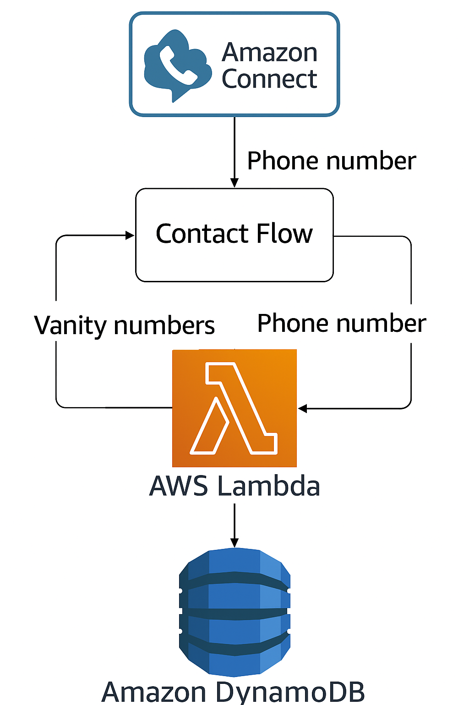

<a href="https://github.com/rjstalb">
  
</a>

[](https://www.linkedin.com/in/rjstalb/)
<rjstalb@gmail.com>

<a id="readme-top"></a>

<!-- PROJECT LOGO -->
<div align="center">
<h1 align="center">AWS Connect Vanity Exercise</h1>

  <p align="center">
    <a href="#about-the-exercise">About</a>
    &middot;
    <a href="#getting-started">Prereqs</a>
  </p>
</div>

<!-- TABLE OF CONTENTS -->
<details>
  <summary>Table of Contents</summary>
  <ol>
    <li>
      <a href="#about-the-exercise">About The Exercise</a>
      <ul>
        <li><a href="#features">Features</a></li>
        <li><a href="#connect-flow">Connect Flow</a></li>
      </ul>
    </li>
    <li><a href="#architecture-diagram">Architecture Diagram</a></li>
    <li>
      <a href="#implementation-notes">Implementation Notes</a>
      <ul>
        <li><a href="#issues-limitations">Issues</a></li>
        <li><a href="#shortcuts">Shortcuts</a></li>
        <li><a href="#unfinished-business">Unfinished Business</a></li>
        <li><a href="#considerations">Scaleability & Security</a></li>
      </ul>
    </li>
    <li><a href="#lambda-setup">Lambda Setup</a></li>
    <li><a href="#platform-development">Platform Development</a></li>
  </ol>
</details>

<!-- ABOUT THE EXERCISE -->
## About The Exercise

This is an AWS SAM-wrapped Connect Flow App using the AWS `Serverless Application Model` absraction on `CloudFormation`. The app is a demonstration of a working Amazon Connect flow using a `Lambda` based phone caller flow to convert the caller's telephone address into vanity numbers, storing the 5 best vanity suggestions into a `DynamoDB` table. Additionally we've added a web app that displays the vanity numbers from the last 5 callers.

<!-- FEATURES -->
#### Features

- A Lambda to convert incoming phone number to a list of potential vanity numbers, saving the best 5 resulting vanity numbers and the caller's number in a DynamoDB table. (`Best` <a href="#definition-of-best-vanity-matches">explained here</a>).
- An Amazon Connect contact flow that looks at the caller's phone number and says the 3 vanity possibilities that come back from the Lambda function.
- Leverages AWS SAM IaaC that allows a user to deploy
  - Lambda
  - Lambda association
  - Connect flow
  - DynamoDB table,
  - and anything else you'd like to add into their own AWS Account/Amazon Connect instance.
  
<p class="text-sm" align="right"><a href="#readme-top">[back to top]</a></p>

<!-- CONNECT FLOW -->
#### Connect Flow

When a Caller reaches the AWS Connect flow, they are greeted with an initial prompt. Then the lambda function generates variations of vanity numbers using the Caller's phone number, saves `5` options to the table and returns a message response to be spoken back to the caller before the call ends.

###### Initial Prompt
>
> "Hi! We're so happy you called. We'll try to build a list of our top 3 vanity number suggestions generated from the phone number you're calling from.""
>
###### Reponse Prompt
>
> "Here are three vanity number suggestions:"

Then each available vanity option is spoken to the user.

###### Error Handling

If there are no vanity suggestions such as a bad number format, internal error, phone number comprised of just 1s and 0s (not likely), the response prompt will instead say:

###### Reponse Prompt
>
>Unfortunately, no vanity number suggestions are available.

The base deliverable is to present the caller with `3` vanity options. If for some reason there aren't `3` vanity suggestions generated, the response prompt will instead respond with the number availble, and then speak them:

###### Reponse Prompt
>
> Only ${num_suggestions} suggestions available. Here { are | is } {num_suggestions} vanity number suggestion(s):

<p class="text-sm" align="right"><a href="#readme-top">[back to top]</a></p>

<!-- ARCHITECTURE DIAGRAM -->
### Architecture Diagram


<!-- IMPLEMENTATION NOTES -->
### Implementation Notes

With the flexibility of choosing an IaaC approach on this exercise, I decided to leverage `SAM` as a CF abstraction since I hadn't relied on a pure SAM approach before. It was a good opportunity to run a full end-to-end SAM provisioning & deployment. The initial approach was to generate a set of resources as a shell, then work on the customizations of each, which is what is now represented in `templates/template-w-flowspec.yaml`

<!-- DEFINITION OF BEST -->
##### Definition of Best Vanity Matches

While I could have spent days|weeks perfecting the intelligence behind building and ranking vanity combinations, I decided to keep it dead simple:

1. Break the phone into area, prefix and line numbers
2. Generate all possibile outcomes (all alphanumeric vanity combinations)
3. Using each of those individual lists (area, prefix, line), find any matching words
   - Restore combinations back to full phone number, `prioritizing` full (prefix+line) word matches,
   - then line-only word matches,
   - then any prefix-only word matches.
4. The first 5 results are taken as the `best` combinations.

This clearly has major gaps but time was not on my side. For instance, we could be optimize by:

- using levenstein proximity to memorable words
- finding 1337 leet matches
- include urban dictionary terms
- include common acronyms
- include colloqialisms
- match those combinations of character pairings which may be considered `more memorable` (based on psych/memory studies, university findings)
- this is a perfect exercise for a hackathon!

<!-- ISSUES -->
#### Issues and Limitations

###### Claiming phone numbers not yet supported in SAM provisioning

> Amazon Connect resources are only partially supported in CloudFormation/SAM. Steps like claiming a phone number need to be handled via Console, CLI or SDK after deployment because CloudFormation does not yet support something like `AWS::Connect::PhoneNumber`
> Solution: SAM provision Connect instance and flow spec, then use console to claim Phone Number and associate with the new Contact FLow/IVR.

###### Refs in Connect Flow JSON

> When running SAM deploy with a full flow spec content, I was unable to reference the lambda ARN using `!Sub`  or string concat/replacment piping on the Content JSON of the `AWS::Connect::ContactFlow`, so the Lambda <> Flow association needed to be manually mapped in the console.

###### Connect Instance modification (rate) limitations over CLI

> I wound up running into `StackUpdateComplete failed` likely due to a limitation on update requests against `AWS::Connect::Instance`. There is a limitation on free/trial dev accounts when deploying/updating Connect instances.

<!-- SHORTCUTS -->
#### Shortcuts

- I reused a single Connect Instance and simply updated Flow and Lamdba deployments during the development process. It would have been great to bulletproof an end-to-end deployment but realistically its not a critical step to resolve once resources are in place. The most important aspect of this exercise (in my view) is to ensure the Flow/Lambda logic do their job correctly, so I was fine compromising and leaving instance deployment rudimentary for now.
- The flow spec was kept minimal. I could have spent a lot more time evolving the decision tree logic (happily) but kept it as simple as possible to deliver the minimal acceptance criteria. Instead, I relied on one single flow prompt from the lambda response which limited my options on the response's data shape as well as added more TTS phrase logic in the helper functions (which built the lambda response). This created some low-hanging fruit for refactoring.
- `Best` vanity suggestions logic leveraged a word list on the file system as a static asset. This was used to proof a helper feature that seeks to match familar words once the vanity number is generated. In order to keep things lean, we're relying on an english-only list of words which I limited to 3-7 characters in lenght. The list includes some colloqialisms but isn't meant to be comprehensive.This is sub-optimal for a number of reasons:
  - English-only
  - no comprehensive acronyms
  - read from filesystem into memory on each handler call
  - doesn't use regex, fuzzy search, levenshtein similarity/proximity, leet speak or any other optimizing
  - would be better handled in an indexed lookup solution with caching.
- Typescript/Lambda tests, models and constants were less-optimized in order to quickly iterate and get the project minimally-viable. The `interface` design could be leaner and more intuitive.

<!-- UNFINISHED BUSINESS -->
#### Unfinished Business

###### "If I only had more time..." :)

- Build a `Best` vanity matching system. This could be a dedicated lambda that comprehensively ranks results based on likelihood of familiarity, having directed the word/acronym/leet lookup against 'region-likely' data using Country Code for language determination, and Area Code for likely familiar coloquiallism added to the suggestions (if any matched).
- Provide a continuous Flow Prompt / Paging response to allow the user to continue to hear more suggestions, and select a suggestion to bookmark for a summary list at the end of the call flow from which they could then choose their favorite.
- Provide a link to a web page of all suggestions, sent to user via SMS.

<!-- CONSIDERATIONS -->
#### Considerations

###### Scalability and Security considerations
>
> What other considerations would you make before making our toy app into something that would be ready for high volumes of traffic, potential attacks from bad folks, etc.

Running a production environment with our architecture (AWS Connect, Lambda, and DynamoDB) we would want to:

- enforce IAM policies with least privilege on
  - dev user
  - deployment user
  - ci/cd roles if any
  - lambda role (accessing db)
- leverage VPCs for  private access control
- integrate with Cognito for secure authentication on web access components if any
- set up mointoring/auditing using CloudTrail and AWS Security Hub
- DynamoDB is already encrypted at rest, but if we switched to something like RDS we'd need to address

<p class="text-sm" align="right"><a href="#readme-top">[back to top]</a></p>

<!-- EXERCISE PREREQS -->
## Getting Started

- AWS CLI is required to authenticate and run deployment commands under an authenticated user profile
- AWS CDK is required for lammbda development, which will be installed when NPM packages are installed `npm install`
- AWS SAM CLI is required for `SAM` development and deployments (see <a href="#platform-development">Platform Development</a> below)

<p class="text-sm" align="right"><a href="#readme-top">[back to top]</a></p>

<!-- LAMBDA SETUP -->
### Lambda Setup

1. Install NPM packages

   ```sh
   npm install
   ```

1. Running Project

   ###### Local Development

      For developing local logic, non-TDD approach. Simply ensure `src/dev-invoke.ts` 's `mockEvent` data and `phoneNumber` are defined.

      ```sh
      npm run dev
      ```

   ###### SAM Invoke (local)

      ```sh
      npm run sam-dev
      ```

   ###### Tests and TDD

    Ensure `tests/index` 's `mockEvent` data and `mockWordSet` are set to the desired data.

    ```sh
    npm run test
    ```

    A note on tests - this is not my favorite or go-to jest config. I instead just relied on basic test harnessing in order to get the lambda built, working, and deploying. The intention was to be a bit more TDD, or at least much more thorough, but time was not on my side.

2. Deploying to AWS

    ```sh
    npm run lambda-dev-deploy
    ```

<p class="text-sm" align="right"><a href="#readme-top">[back to top]</a></p>

<!-- PLATFORM DEVELOPMENT -->
### Platform Development

1. Install AWS SAM CLI [instructions](https://docs.aws.amazon.com/serverless-application-model/latest/developerguide/install-sam-cli.html)

    ```sh
    # helpful reference commands
    sam init # initializes samconfig toml if one isn't present, in our case, we have ours committed
    sam validate # validates toml config
    ```

2. IAM Setup

   ###### Least Priveleged Approach

    To ensure IAM users are prepared ahead of deploying the full application, we recommend configuring the IAM setup as a first step. If you need to create a user with the privaleges needed, see the `user.yaml` template, which can also be run using the following:

    ```
    sam deploy --guided -t ./users.yaml --capabilities CAPABILITY_NAMED_IAM
    ```

    > This IAM User is added to a group with policies granting the user:
    >- Lambda management
    >- DynamoDB CRUD
    >- Connect instance + flow creation and management
  
   ###### Alternative Approach

    Local User profile with longer-term privileges (setup guide <a href="https://docs.aws.amazon.com/cli/v1/userguide/cli-configure-files.html">here</a>)

1. Deployments

   ###### Deploy full application solution

      ```sh
      npm run deploy # npm run build && sam deploy --guided
      ```

   ###### Deploy application with full flow spec

      ```sh
      npm run build && sam deploy --guided -t ./templates/template-w-flowspec.yaml
      ```

   ###### Deploy Connect instance standalone

      ```sh
      npm run build && sam deploy --guided -t ./templates/connect.yaml
      ```

   ###### Deploy flow-only, using JSON

   - `https://<instance>.my.connect.aws/contact-flows`
   - Click `Create flow`
   - Drop-down Save action
       - select `Import (beta)`
       - Choose file `./templates/flow.json`
   - Edit settings of the `Invoke AWS Lambda function` flow block
     - `Function ARN > Set manually > select the lambda ARN`
   - Click `Save`
   - Click `Publish`

<p class="text-sm" align="right"><a href="#readme-top">[back to top]</a></p>

<div align="center">

### Built on [![AWS][aws-shield]][dynamodb-url] [![DynamoDB][dynamodb-shield]][dynamodb-url]

</div>

##### PS. A note about the readme
>
> I usually stick to pure markdown. I can't tell you why I used this approach other than I hadn't in a while an I like the expandable TOC. HTML is def unecessary though :D
>
<!-- MARKDOWN LINKS & IMAGES -->
<!-- https://www.markdownguide.org/basic-syntax/#reference-style-links -->
[aws-shield]: https://img.shields.io/badge/AWS-%23FF9900.svg?style=for-the-badge&logo=amazon-web-services&logoColor=white
[dynamodb-shield]: https://img.shields.io/badge/DynamoDB-4053D6?style=for-the-badge&logo=amazondynamodb&logoColor=fff
[dynamodb-url]: https://aws.amazon.com/dynamodb/
